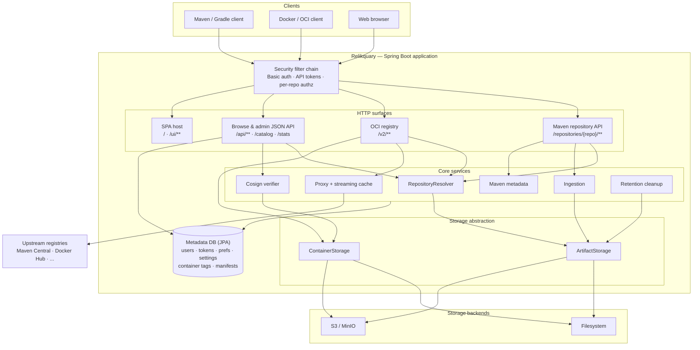

# Architecture Overview

The major moving parts of the Relikquary server and how requests flow from clients down to storage.

## Notes

- **Two protocols, one server.** The Maven surface (`/repositories/{repo}/**`) and the OCI surface (`/v2/**`)
  are served by the same application over the same storage abstraction and security chain.
- **Storage is pluggable.** `ArtifactStorage` (Maven bytes) and `ContainerStorage` (blobs + manifests) both
  resolve to the configured backend — filesystem or S3/MinIO — chosen by configuration.
- **The DB holds metadata only**, not artifact bytes: managed users, API tokens, user preferences, settings,
  and the container tag/manifest index. Artifact and blob bytes live in the storage backend.
- **The web UI is hosted by the backend** in production (static SvelteKit build served under `/` and `/ui/**`).
