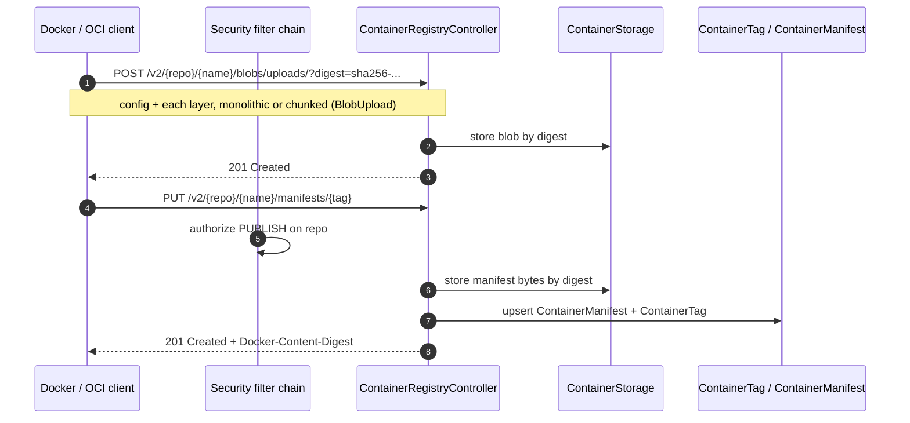
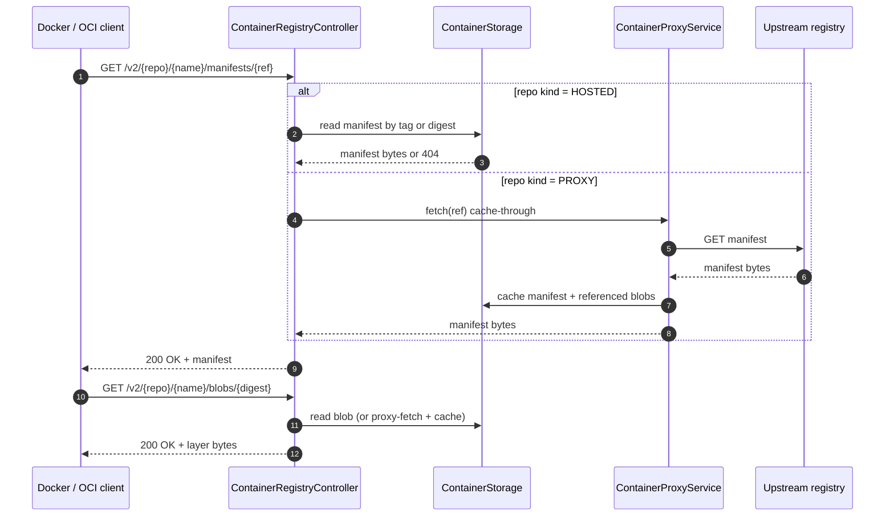

# Container Registry (`/v2`) Flows

Relikquary implements the OCI/Docker registry protocol so `docker push` / `docker pull` work against a hosted
or proxy container repository.

## Push (`docker push`)

## Pull (`docker pull`) — hosted or proxy

## Notes

- **Blob uploads** may be monolithic (`?digest=` on the POST) or chunked; chunked uploads track progress in a
  `BlobUpload` row until finalized.
- **The tag/manifest index** (`ContainerTag`, `ContainerManifest`) lets the web UI list images, tags, digests,
  and sizes without re-reading every manifest from storage.
- **Cosign signatures** are pushed like any other image — as a companion `sha256-<digest>.sig` artifact — so
  verification (see [cosign-verification](./cosign-verification.md)) only reads already-stored bytes.
- **Advisory only:** signature verification never blocks or alters a push/pull and changes no `/v2` wire
  behavior.
