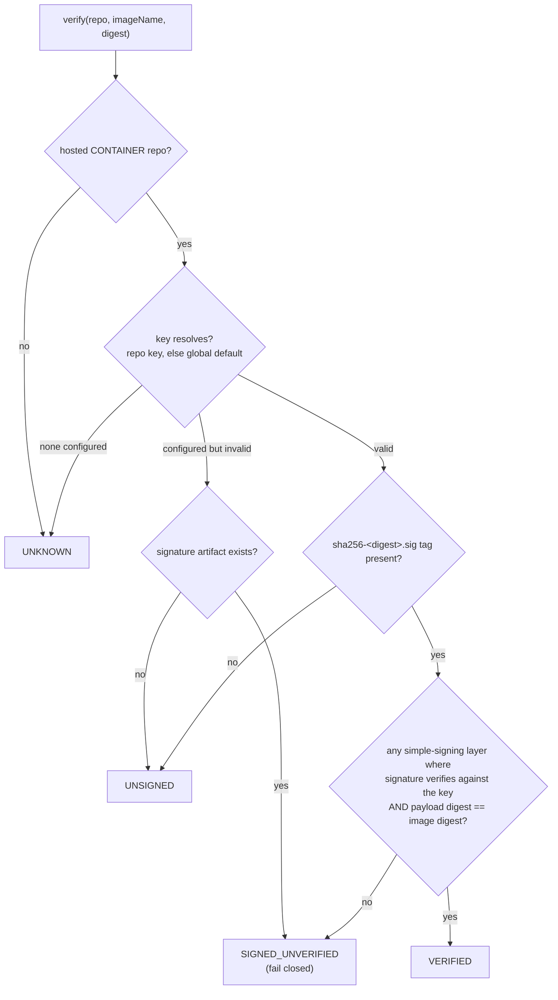
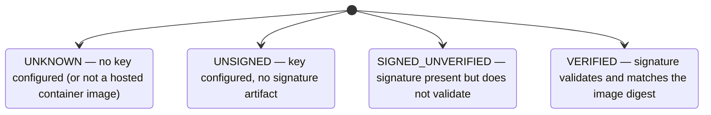

# Cosign Signature Verification (feature 024)

Advisory, key-based cosign verification for hosted container images. It reads only already-stored bytes and
never affects a `docker pull`/`push`; it produces a **trust status** surfaced as a badge in the web UI.

## Trust-status decision flow

## Status meanings

## How verification works

1. **Resolve the key** (`CosignKeys`): the repository's own `cosignPublicKey`, else the global
   `relikquary.cosign.default-public-key`. The value is an inline PEM or a file path, parsed as EC / RSA /
   Ed25519. A configured-but-unparseable key resolves to *invalid* and **fails closed** (never `VERIFIED`).
2. **Find the signature artifact** (`CosignVerifier`): the cosign convention tags a signature
   `sha256-<hex>.sig` under the same image name.
3. **Verify each simple-signing layer**: base64-decode the `dev.cosignproject.cosign/signature` annotation,
   verify it (via `java.security.Signature`) over the layer's payload blob, and confirm the payload's
   `docker-manifest-digest` equals the image digest. Any qualifying layer ⇒ `VERIFIED`.

The resulting status rides along on the browse API's tag and manifest-detail responses and renders as a
`TrustBadge` in the UI. Out of scope: keyless/Fulcio/Rekor, enforcement/blocking, and Maven artifacts.
