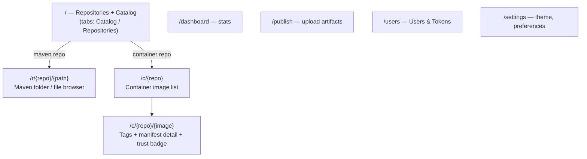
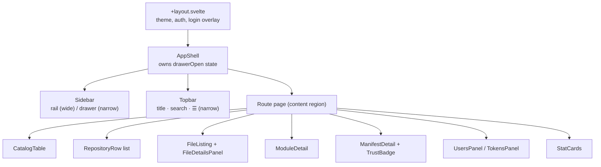
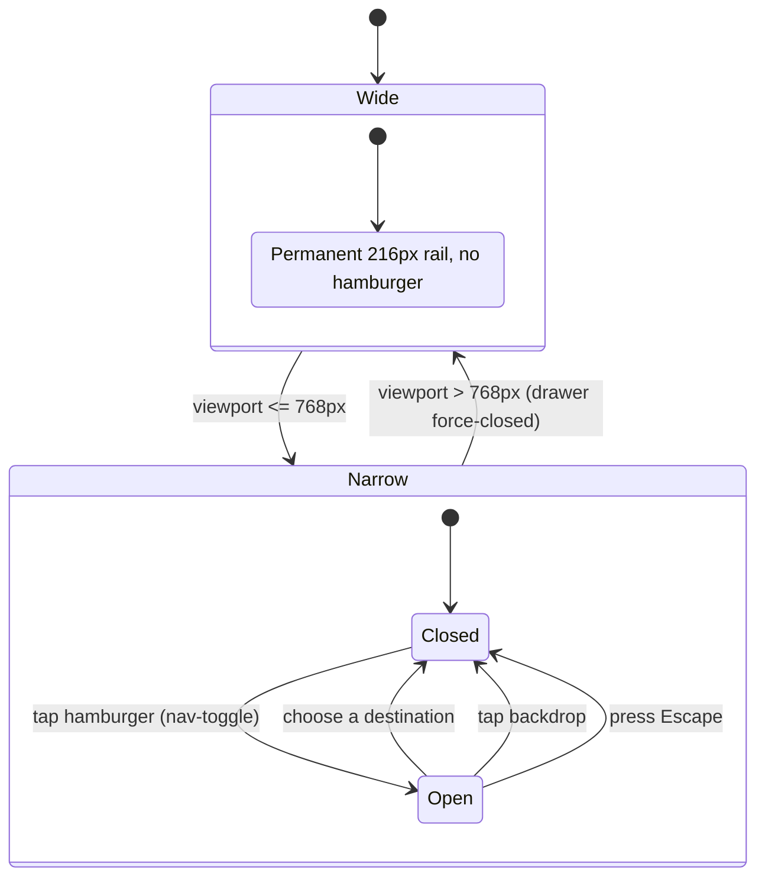

# Frontend UI

A SvelteKit 5 (runes) single-page app, vault-themed, served by the backend in production. It is responsive as
of feature 025 (see the drawer state machine below).

## Route map

## Component shell

## Responsive navigation (feature 025)

A single 768px breakpoint separates the permanent desktop rail from a mobile overlay drawer. `AppShell` owns
the open/closed state.

## Notes

- **Content that is too wide** (catalog, file listing, container tag/image tables, users/tokens tables) scrolls
  inside its own `.rq-scroll-x` region so the page never scrolls sideways as a whole.
- **The drawer reuses the same `Sidebar` markup** as the desktop rail, so the section list and the
  sign-in/out affordance are identical in both modes.
- **In development** the app runs under `vite dev`, which proxies `/api`, `/v2`, and repository paths to the
  backend on `:8080`. **In production** the static build is served by the backend's `UiController`.
