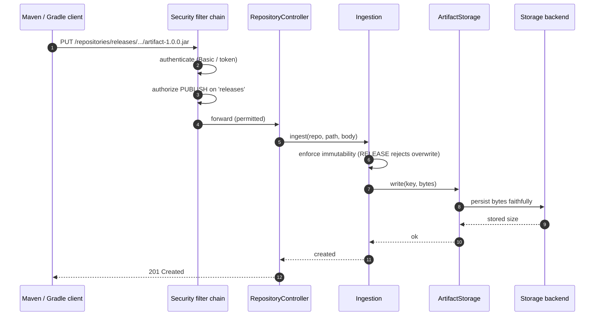
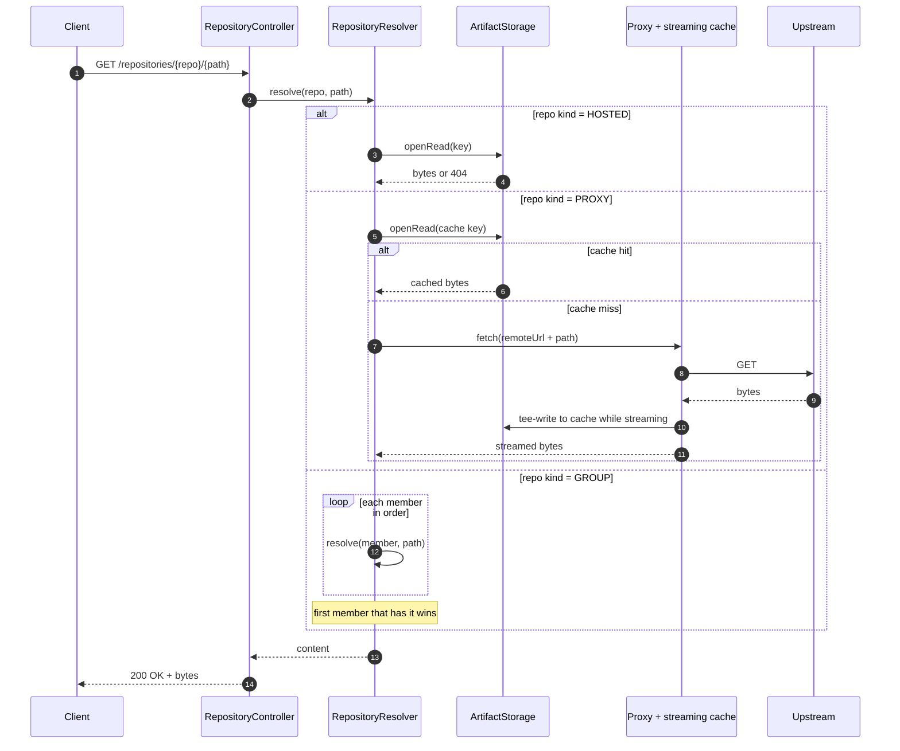

# Maven / Gradle Flows

## Publish (PUT to a hosted repository)

## Resolve (GET) — hosted, proxy, or group

## Notes

- **Faithful storage (Principle IV):** stored bytes, consumer checksums, and signatures are served back
  exactly — never re-checksummed or rewritten.
- **Proxy caching** streams the upstream response to the client and to the cache at the same time
  (`TeeInputStream`), so the first requester is not blocked waiting for the full download to persist.
- **Maven metadata** (`maven-metadata.xml`, snapshot timestamps) is produced by the metadata service for
  hosted repositories so standard clients resolve versions correctly.
