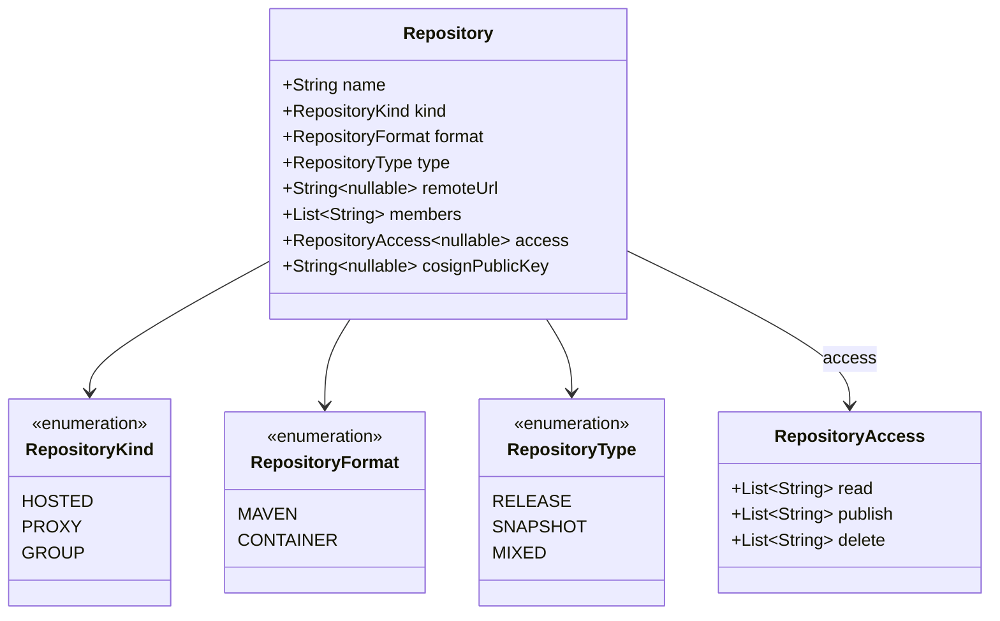
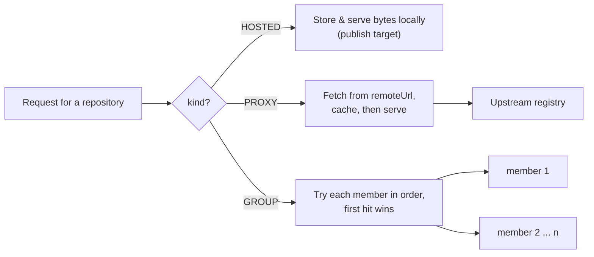

# Repository Model

Every configured repository has a **kind**, a **format**, and (for Maven) a **type**, plus optional proxy,
group, access, and cosign settings. These come from `RepositoryProperties.Repo`.

## What each kind means

## Field applicability

| Field | HOSTED | PROXY | GROUP |
|-------|:------:|:-----:|:-----:|
| `type` (RELEASE/SNAPSHOT/MIXED) — Maven immutability | ✅ | — | — |
| `remoteUrl` — upstream to proxy | — | ✅ | — |
| `members` — repositories to aggregate | — | — | ✅ |
| `access` — per-repo read/publish/delete lists | ✅ | ✅ | ✅ |
| `cosignPublicKey` — advisory trust (CONTAINER only) | ✅ | — | — |

- **Format** decides which protocol serves the repo: `MAVEN` → `/repositories/{repo}/**`, `CONTAINER` →
  `/v2/{repo}/**`.
- **Type** applies to Maven only: a `RELEASE` repo rejects overwrites (immutable), a `SNAPSHOT` repo allows
  re-publishing, `MIXED` accepts both coordinate styles.
