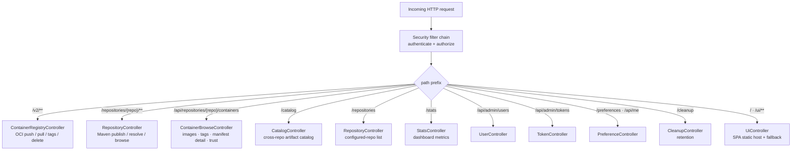

# Request Routing

How an incoming HTTP request is dispatched to a controller, after passing the security filter chain.

## Surfaces at a glance

| Prefix | Controller | Purpose |
|--------|-----------|---------|
| `/v2/**` | `ContainerRegistryController` | OCI/Docker registry protocol |
| `/repositories/{repo}/**` | `BrowseController` / `RepositoryController` | Maven publish, resolve, folder browse |
| `/api/repositories/{repo}/containers` | `ContainerBrowseController` | Container browse JSON for the web UI |
| `/catalog` | `CatalogController` | Cross-repository searchable artifact catalog |
| `/stats` | `StatsController` | Dashboard counts |
| `/api/admin/users`, `/api/admin/tokens` | `UserController`, `TokenController` | Managed users and API tokens |
| `/preferences`, `/api/me` | `PreferenceController` | Per-user theme and identity |
| `/cleanup` | `CleanupController` | Snapshot retention operations |
| `/`, `/ui/**` | `UiController` | Serves the built SvelteKit SPA |
