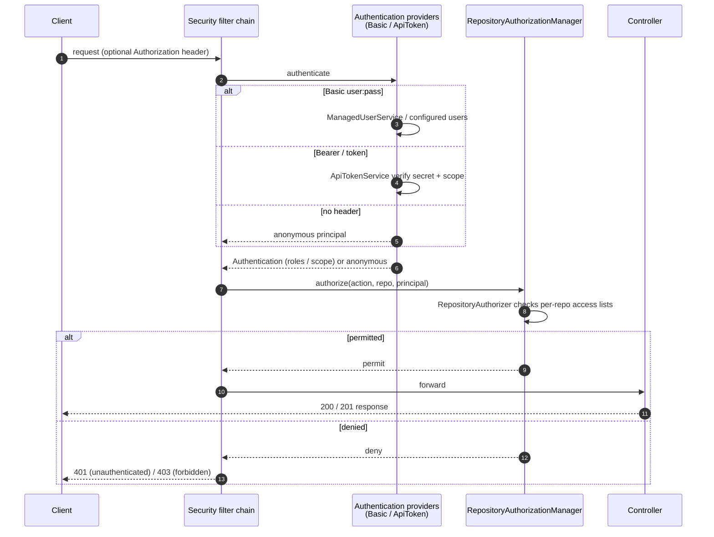
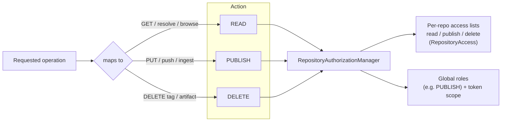

# Security & Authorization

Relikquary supports **anonymous** use plus **Basic auth** (managed or configured users) and **API tokens**.
Authorization is enforced **per repository** for the actions READ, PUBLISH, and DELETE.

## Authentication + authorization on a request

## Action model

## Notes

- **Anonymous is a first-class principal**: an open (public-read) repository serves GETs without credentials;
  signing in is optional and only required where an access list demands it.
- **API tokens** carry a `TokenScope` and are verified against a stored `secretHash`; a revoked token
  (`revokedAt` set) is rejected.
- **Per-repo access** (`RepositoryAccess`: `read` / `publish` / `delete` username lists) narrows a repository
  to specific users; absence means the repository's default (e.g. open read, role-gated publish) applies.
- The same authorization gate protects both the Maven and the `/v2` surfaces, and the browse API only shows a
  repository's contents to a permitted reader.
