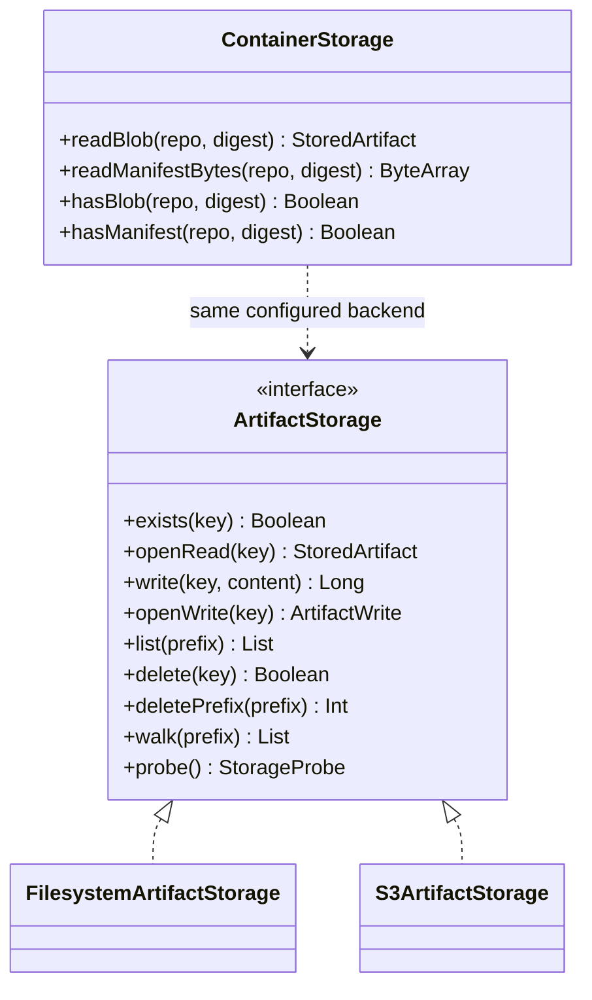
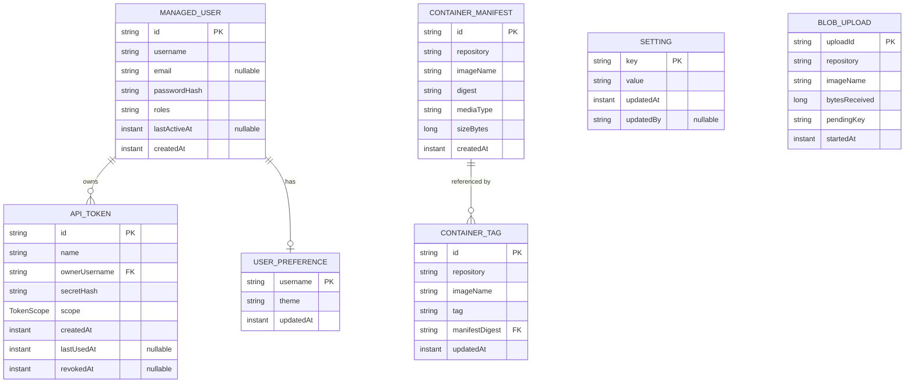

# Storage & Data Model

## Storage abstraction

Artifact and blob **bytes** go through a pluggable storage interface; the concrete backend (filesystem or
S3/MinIO) is chosen by configuration.

## Persisted entities (metadata DB)

The database stores **metadata only** — artifact and blob bytes live in the storage backend.

## Notes

- **`SETTING`** is a small key/value store for server-wide settings. **`USER_PREFERENCE`** holds each user's
  chosen theme.
- **`BLOB_UPLOAD`** is transient bookkeeping for in-progress chunked container blob uploads; it is cleared once
  an upload is finalized into a stored blob.
- **`CONTAINER_TAG` → `CONTAINER_MANIFEST`** is a soft reference by `(repository, imageName, manifestDigest)`;
  many tags can point at the same manifest digest.
